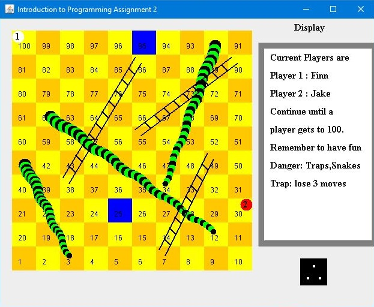

# COSC1519 AT1 | Snakes, Ladders & Traps Game
**Course Name:** Introduction to Programming

A Java project that recreates the traditional Snakes & Ladders game, introducing "traps" which prevent the player from advancing after a certain number of turns have passed.

This assignment focuses on being able to implement the game’s logic and expand upon them by including additional options to allow the players to customise the game board at runtime, utilising the skills and coding conventions learnt during the course so far. A bonus feature was also implemented, where the player is allowed to set a trap on their position instead of rolling the dice and moving; this makes the game more strategic as it would let the opponent to catch up but if they were to land on said trap then they would lose double the number of moves.

**Note:** This project was adapted from a template which was provided to students by the school faculty as to make it easier for them to mark assignment submissions.
